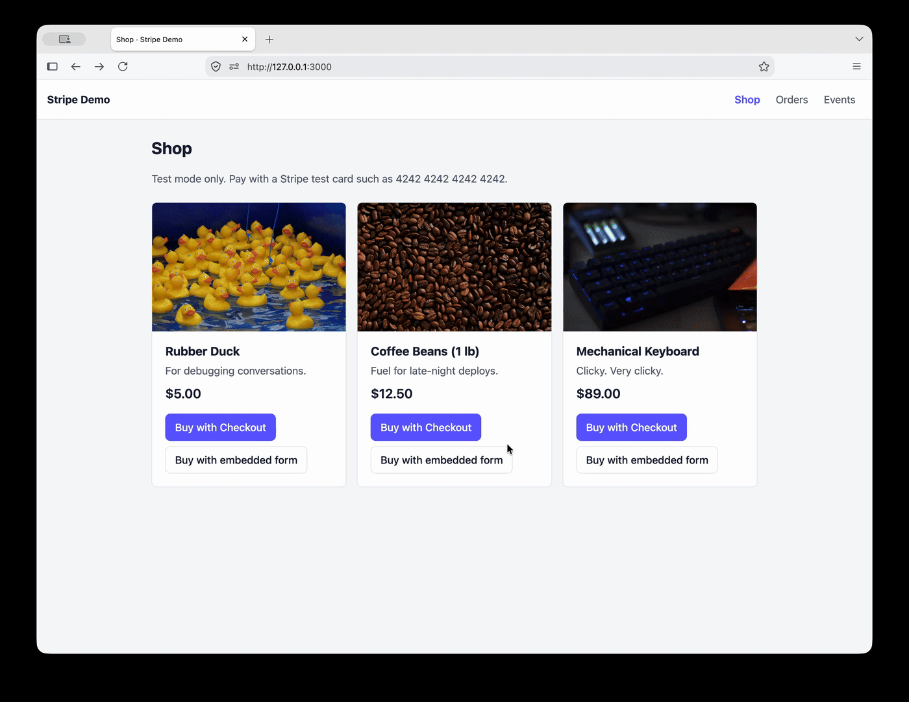

# Stripe Demo Shop

A tiny shop for learning how Stripe payments work from start to finish: creating a payment, confirming it through webhooks, and recording the result.

<p align="center">
  
</p>

- **Local only.** The server listens on `127.0.0.1` and is never meant to be deployed.
- **Test mode only.** The server refuses to start unless the keys are `sk_test_…` and `pk_test_…`. Live keys (`sk_live_…`) are rejected with an error.
- **No real money.** Test mode uses Stripe's test cards. Real card numbers are never accepted.

Stack: Node 24, Express, SQLite through the built-in `node:sqlite` module, and plain HTML/JS pages. The server, tests and e2e suite are TypeScript, which Node 24 runs directly by stripping the types. There's no build step: `tsc` only type-checks.

## Prerequisites

- Node.js 24 or later
- The Stripe CLI, which forwards webhooks to your machine:

  ```sh
  brew install stripe/stripe-cli/stripe
  stripe login
  ```

## Setup

1. Install dependencies:

   ```sh
   npm install
   ```

2. Create your `.env`:

   ```sh
   cp .env.example .env
   ```

   Turn on **Test mode** in the Stripe Dashboard, open **Developers → API keys**, and copy the keys into `.env`:
   - `STRIPE_SECRET_KEY=sk_test_…`
   - `STRIPE_PUBLISHABLE_KEY=pk_test_…`

   `PORT` (default `3000`) and `DATABASE_PATH` (default `data/stripe-demo.db`) are optional.

3. In a second terminal, forward webhooks to the app:

   ```sh
   stripe listen --all-snapshot --forward-to 127.0.0.1:3000/webhook
   ```

   It prints a signing secret (`whsec_…`). Paste it into `.env` as `STRIPE_WEBHOOK_SECRET`. Keep this terminal running while you use the app.

4. Start the app and open <http://127.0.0.1:3000>:

   ```sh
   npm start
   ```

**Why `127.0.0.1` and not `localhost`?** The server binds to IPv4 `127.0.0.1` only. On macOS, `localhost` can resolve to the IPv6 address `::1`, where nothing is listening, so requests to `localhost` may fail. Use `127.0.0.1` in the browser and in the `stripe listen` target. If you change `PORT`, change the port in the forward target too.

If `STRIPE_WEBHOOK_SECRET` is missing, the server still starts, but it prints a warning banner and rejects every webhook with `503` until you set it and restart.

## Test cards

| Card number | Result |
|---|---|
| `4242 4242 4242 4242` | Succeeds |
| `4000 0000 0000 9995` | Declined (insufficient funds) |
| `4000 0025 0000 3155` | Requires 3D Secure authentication |

Use any future expiry date, any CVC and any ZIP code.

## Donations

The **Donate** page takes any amount from $1.00 to $1,000.00, chosen from the $5, $10 and $25 presets or typed in, and pays it through either flow below.

- **Validation:** the server validates the amount in `resolveItem` (`src/catalog.ts`), whatever the browser sent. This is the one place the browser chooses a price; catalog products ignore any amount they're sent.
- **Precision:** dollars are converted to cents with string arithmetic, because in floating point `19.99 * 100` isn't exactly 1999.
- **Storage:** a donation is stored as an ordinary order for the product `donation`, so webhooks, refunds and the event log work unchanged.

## Two ways to pay

Each product has two buttons:

- **Buy with Checkout:** the server creates an order and a Checkout Session, then redirects you to Stripe's hosted payment page. After paying you return to the local success page. If you cancel, you land on the cancel page. The server then expires the session, and the resulting `checkout.session.expired` webhook marks the order `canceled`.
- **Buy with embedded form:** the Stripe Payment Element is rendered inside our own page (`pay.html`). The server creates a PaymentIntent and sends only its client secret to the browser. A decline shows Stripe's error message inline, and you can retry with another card without reloading. 3D Secure appears as a modal.

In both cases the price comes from the server's catalog; anything the browser sends is ignored. The success page never marks an order paid by itself: it polls the order for up to 30 seconds until a webhook changes its status.

## Webhooks

Webhooks are the only thing that changes an order's status. Every event is signature-checked, recorded in the event log, and applied at most once.

### Handled events

| Event type | Sets the order to | Condition |
|---|---|---|
| `checkout.session.completed` | `paid` | `payment_status` is `paid` |
| `payment_intent.succeeded` | `paid` | always |
| `payment_intent.payment_failed` | `failed` | always |
| `checkout.session.expired` | `canceled` | always |
| `charge.refunded` | `refunded` | full refund only (`refunded` is `true`) |

Any other event type is acknowledged and logged as `ignored_unhandled_type`. Stripe sends many of these during a normal payment (for example `payment_intent.created` and `charge.succeeded`), so expect to see them on the events page.

### Allowed status transitions

```
pending → paid | failed | canceled
failed  → paid        (a retry that succeeds)
paid    → refunded
```

Stripe doesn't guarantee event order, so any other change, such as `payment_intent.payment_failed` arriving after `paid`, is logged as `ignored_transition` and leaves the order alone.

### Event log outcomes

| Outcome | Meaning |
|---|---|
| `applied` | The order's status changed |
| `ignored_duplicate` | This event ID was already processed (even before a restart) |
| `ignored_transition` | The requested change isn't an allowed transition |
| `ignored_unknown_order` | No local order matches the event |
| `ignored_unhandled_type` | The event makes no status request |

**Checkout sends two events per payment.** A hosted Checkout payment produces both `payment_intent.succeeded` and `checkout.session.completed`, in either order. The first one marks the order `paid`. The second asks for `paid → paid`, so it shows as `ignored_transition` ("already paid"). This is expected: one payment often produces more than one event.

### Exercising webhooks without buying anything

```sh
stripe trigger payment_intent.succeeded
```

This creates a real test payment that has no matching local order, so the `payment_intent.succeeded` event shows on the events page as `ignored_unknown_order`.

```sh
stripe events resend <evt_id>
```

Copy an event ID (`evt_…`) from the events page. Resending an event that was already processed adds an `ignored_duplicate` entry and leaves the order unchanged.

### Why the webhook secret matters

Stripe signs every webhook with HMAC-SHA256, using the signing secret over the event's timestamp and exact raw body. The server recomputes the signature and rejects the event with `400` if it's missing, wrong, or more than 5 minutes old. Without this check, anyone who could reach `/webhook` could post a fake `payment_intent.succeeded` and mark an order paid.

HMAC uses a symmetric secret: the same `whsec_…` value both creates and checks signatures. Anyone who has it can forge events that the server will accept, so treat it like a password and keep it out of source control.

## Data

Orders, the event log and the IDs of processed events are stored in SQLite at `data/stripe-demo.db` (set `DATABASE_PATH` to change it). They survive restarts, and `data/` is git-ignored.

To reset, stop the server and delete the directory:

```sh
rm -rf data/
```

The schema is recreated on the next start. There is no migration tooling, so this is also the fix after a schema change.

## Tests

```sh
npm test
```

`npm test` first type-checks the whole project in strict mode (`npm run typecheck`, which runs `tsc -p .`), then runs the tests with Node's built-in test runner. A type error fails it.

The tests run offline and need no Stripe keys or `.env`: Stripe API calls go through a fake gateway, and webhook tests sign payloads with a test secret using Stripe's real signing scheme.

**TypeScript rules:** Node can only run TypeScript whose types it can simply delete. `tsconfig.json` sets `erasableSyntaxOnly`, which rejects `enum`, `namespace` and constructor parameter properties. Use union types instead. Relative imports use `.ts` extensions. Shared types live in `src/types.ts`, and Stripe objects use the `stripe` package's own types (`Stripe.Event`, `Stripe.Checkout.Session`, …).

### End-to-end tests (opt-in)

```sh
npm run test:e2e
```

This runs the real app against **real Stripe test mode**, with events delivered by a real `stripe listen`. It takes about 10 seconds.

**What it needs:**
- your test keys in `.env`
- the Stripe CLI, logged into the same account as those keys (`stripe login`)
- network access

**What it sets up for itself:**
- It gets the webhook secret from `stripe listen --print-secret`, so it ignores `STRIPE_WEBHOOK_SECRET`.
- It starts its own `stripe listen` and its own server on a random port.
- It uses a temporary database, so your `data/` is never touched.

**What it covers:** there's no browser. Payments are driven through Stripe's API with test payment methods such as `pm_card_visa`. The suite checks:
- an embedded payment succeeds
- a decline, then a successful retry (`failed → paid`)
- a refund
- cancelling Checkout, which ends with the order `canceled`
- a real `stripe events resend`, logged as `ignored_duplicate`
- `stripe trigger`, logged as `ignored_unknown_order`

Completing hosted Checkout and the 3D Secure challenge need a browser, so those stay manual checks.

**If a flow times out,** the failure message includes the app's recent webhook log. If you have another `stripe listen` running, it receives these test events too, and your dev server logs them as `ignored_unknown_order`.

## Project layout

```
src/        Express server (TypeScript): config, catalog, SQLite repositories, Stripe
            gateway, webhook verifier and processor, routes; shared types in types.ts
public/     Static pages (JavaScript): shop, embedded payment, success, cancel, orders, events
test/       Unit and HTTP integration tests, plus helpers (TypeScript)
e2e/        Opt-in end-to-end tests against Stripe test mode (TypeScript)
specs/      requirements.md, design.md, tasks.md
```

For how it works in detail, see [`specs/requirements.md`](specs/requirements.md) (what it must do) and [`specs/design.md`](specs/design.md) (architecture, database schema, webhook processing and API).

## Sharing with ngrok

The server listens only on `127.0.0.1`. To show the site to someone else temporarily, put a tunnel in front of it:

```sh
ngrok http 127.0.0.1:3000
```

1. Copy the `https://…ngrok-free.app` URL that ngrok prints into `.env` as `BASE_URL=https://…ngrok-free.app`, then restart `npm start`.
   - Hosted Checkout needs this setting. Without it, visitors who pay are sent back to `127.0.0.1` on *their own* computer, which fails.
   - The embedded form works either way.
2. Keep `stripe listen` running as usual. Webhooks still reach the server locally, so there's nothing to register in the Stripe Dashboard.
3. When you're done, stop ngrok and remove `BASE_URL`. Free ngrok URLs change every time ngrok restarts, so update `BASE_URL` each time.

**What to expect:**
- **Test mode only:** visitors pay with test cards. Real cards are rejected.
- **No authentication:** anyone with the URL can see every order and webhook event, create payments in your Stripe test account, and refund orders. That's acceptable for a dummy site, but don't share the URL widely. ngrok's own access controls, such as basic auth, can restrict who gets in.
- **ngrok's warning page:** free ngrok shows a "You are about to visit…" page before the site. That's normal.

## Security notes

- Secrets live in `.env`, which is git-ignored. Only `.env.example`, which has placeholder values, is committed. The server never logs secrets or client secrets.
- Card data never touches this server. Card details are typed only into Stripe's hosted Checkout page or into the Payment Element, which runs in a Stripe iframe.
- The server listens on `127.0.0.1` only, so it isn't reachable from other machines.
