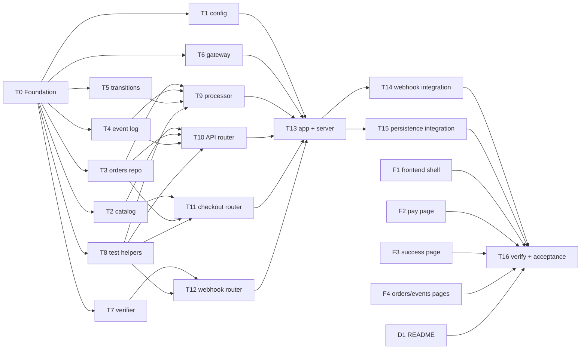

# Tasks: Stripe Demo Shop

These tasks implement [design.md](design.md), which implements [requirements.md](requirements.md). They're arranged so that as much work as possible runs in parallel. Every task owns a separate set of files and builds only against the interfaces fixed in the design. No task waits on another task's implementation unless its tests actually run that code.

## Rules for every task

1. **Only edit files you own.** Each task lists the files it owns. Don't create or edit anything else, including `package.json`, `package-lock.json` and other tasks' files. If you need another task's module and it doesn't exist yet, you've started too early: check the dependencies.
2. **The design is the contract.** Implement signatures, return shapes, status codes and SQL exactly as `design.md` specifies. If a contract looks wrong, stop and report it instead of working around it. Changes to a contract go through `design.md` first.
3. **Tests come with the code.** Every task that owns code also owns its tests, and is done only when `node --test <its test files>` passes. Tests must not use the network or real keys, and must not depend on `.env`: pass config explicitly. Use a silent logger stub, `{ info() {}, warn() {}, error() {} }`, so test output stays clean.
4. **Style.** ESM, named exports, factory functions, no classes except error types. No new dependencies. Comments only where they explain *why*.
5. **Secrets.** Never read `.env`, and never log secrets or client secrets. Fake keys in tests must not look like real ones: use short, underscore-separated placeholders such as `sk_test_fake_key` or `sk_live_fake_do_not_print`. Anything like `sk_live_51` followed by 20 or more letters and digits trips GitHub push protection.
6. **Git.** Each task is one commit whose message explains why. The orchestrator runs every task in a wave in its own worktree, merges them once the whole wave passes, runs `npm test` on the result, and pushes.

## Dependency graph

## Schedule

| Wave | Tasks (run in parallel within a wave) | Width |
|---|---|---|
| **Wave 0** | T0 · F1 · F2 · F3 · F4 · D1 | 6 |
| **Wave 1** | T1 · T2 · T3 · T4 · T5 · T6 · T7 · T8 | 8 |
| **Wave 2** | T9 · T10 · T11 · T12 | 4 |
| **Wave 3** | T13 | 1 |
| **Wave 4** | T14 · T15 | 2 |
| **Wave 5** | T16 | 1 |

The frontend (F\*) and README (D1) tasks depend only on the design, so they start in wave 0 alongside the foundation. They can merge any time before T16.

The critical path is T0 → T3 → T9 → T13 → T14 → T16.

---

## Wave 0

### T0: Foundation *(S)*
**Owns:** `package.json`, `package-lock.json`, `src/db.js`, `test/db.test.js`
**Depends on:** –
**Covers:** R8.3, R9.1, R9.2, R9.4, C5, N3

- Create `package.json`:
  - `"name": "stripe-demo"`, `"private": true`, `"type": "module"`, `"engines": { "node": ">=24" }`
  - Scripts: `"start": "node src/server.js"`, `"test": "node --test"`
  - Dependencies: `express@^5`, `stripe@^22`, `dotenv`, and no devDependencies
- Run `npm install` and commit the lockfile.
- Implement `openDb(path)` exactly as in design §5: create the directory unless the path is `:memory:`, set the pragmas, and apply the schema.

**Tests** (`db.test.js`):
- All three tables and the index exist.
- CHECK constraints reject a bad `status`, `method` and `outcome`, and a non-positive `amount_cents`.
- Opening a temp-file DB, inserting a row, closing it and reopening it keeps the row.
- Reopening doesn't fail and doesn't wipe data.
- Opening a path in a directory that doesn't exist creates the directory.

### F1: Frontend shell and catalog page *(S)*
**Owns:** `public/styles.css`, `public/common.js`, `public/index.html`, `public/index.js`, `public/cancel.html`
**Depends on:** – (builds against design §10 and §11)
**Covers:** R1.1, R1.2, R2.4

- `common.js` exports `fetchJson(url, opts)`, `statusBadge(status)` and `outcomeBadge(outcome)` as in design §11. The badges return DOM elements. Every page's script imports these.
- `styles.css`: minimal and readable, with one color per status and outcome. It also gets a shared nav (Shop · Orders · Events) that every page repeats in its markup.
- `index.html`/`index.js`: render products from `GET /api/products`. Each product card has:
  - a `<form method="post" action="/checkout">` with a hidden `productId` and a "Buy with Checkout" button
  - a "Buy with embedded form" link to `pay.html?product=<id>`
- `cancel.html`: a static message with links back to the shop and the orders page.
- Insert all data with `textContent`, never with `innerHTML`.

**Verification:** there are no automated browser tests (see T16). Pages are checked by hand in T16.

### F2: Embedded payment page *(M)*
**Owns:** `public/pay.html`, `public/pay.js`
**Depends on:** – (imports `common.js` per the F1 contract)
**Covers:** R3.2, R3.3, R3.4, C3

Build this as design §11 describes:
1. Load `https://js.stripe.com/v3/` and fetch `/api/config`.
2. `POST /api/payment-intents` with `{ productId }` from the query string.
3. Mount the `payment` element.
4. On submit, call `confirmPayment` with `redirect: 'if_required'` and a `return_url` of `/success.html?order_id=…`.
5. Show errors inline and keep the element mounted so the visitor can retry. Disable the submit button while a payment is in flight.
6. On success, navigate to the success page.

Show a clear error if the product is unknown (a 400 from the API).

### F3: Success page *(S)*
**Owns:** `public/success.html`, `public/success.js`
**Depends on:** –
**Covers:** R2.3, R4.5

Read `order_id`, then poll `GET /api/orders/:id` every 1 second while the status is `pending`, for at most 30 seconds. Show the order ID, product, price and status badge. After the timeout, suggest checking that `stripe listen` is running. Link to the order detail page.

### F4: Orders, order detail and events pages *(M)*
**Owns:** `public/orders.html`, `public/orders.js`, `public/order.html`, `public/order.js`, `public/events.html`, `public/events.js`
**Depends on:** –
**Covers:** R5.1–R5.4, R6.1

- **`orders.html`:** a table with the R5.1 columns, a Dashboard link and a link to the order detail page. `paid` rows get a Refund button: `POST /api/orders/:id/refund`, then poll that order until its status changes, showing `409`/`502` errors inline.
- **`order.html?id=`:** the order's fields, plus its events table (oldest first) with outcome badges.
- **`events.html`:** a table with time, type, linked order, outcome badge, detail and Dashboard link.

### D1: README *(S)*
**Owns:** `README.md`
**Depends on:** –
**Covers:** R8.1, R8.2, R8.4

Sections:
- What this is: a local-only, test-mode demo.
- Prerequisites: Node 24 and the Stripe CLI (`brew install stripe/stripe-cli/stripe`, then `stripe login`).
- Setup:
  - Copy `.env.example` to `.env` and fill in the test keys.
  - Run `stripe listen --all-snapshot --forward-to 127.0.0.1:3000/webhook`, then paste the `whsec_` it prints.
  - Start with `npm start`.
- Test cards: the three from R8.2, with any future expiry date, any CVC and any ZIP code.
- Exercising webhooks:
  - `stripe trigger payment_intent.succeeded`, which is expected to show as `ignored_unknown_order`
  - `stripe events resend <evt_id>`, which is expected to show as `ignored_duplicate`
- The events we handle, and what each one does to an order.
- Resetting: delete `data/`.
- Running tests: `npm test` needs no keys.
- A short "How it works" section linking to the specs.

---

## Wave 1 (after T0)

### T1: Config *(S)*
**Owns:** `src/config.js`, `test/config.test.js`
**Depends on:** T0
**Covers:** R7.1–R7.4, N4

Implement `loadConfig(env)` and `ConfigError` as in design §3.

**Tests:**
- Valid config gives the documented defaults (`port` 3000, `databasePath`, `baseUrl` on `127.0.0.1`).
- A missing secret key, `sk_live_`, or anything else not starting with `sk_test_` throws. The same goes for publishable keys.
- A missing webhook secret gives `null`; a webhook secret without the `whsec_` prefix throws.
- A bad `PORT` throws.
- The error message never contains the value that was passed in (assert the full key string is absent).
- The returned object is frozen.

### T2: Catalog *(S)*
**Owns:** `src/catalog.js`, `test/catalog.test.js`
**Depends on:** T0
**Covers:** R1.1, R1.3

Implement design §4.

**Tests:**
- `getProduct` returns the product for known IDs and `undefined` for unknown ones.
- `formatPrice(500)` gives `$5.00`, and `1250` gives `$12.50`.
- Every product has a unique ID and an integer `amountCents` of at least 50.

### T3: Orders repository *(M)*
**Owns:** `src/orders.js`, `test/orders.test.js`
**Depends on:** T0
**Covers:** R2.1, R3.1, R5.1, R9.4

Implement design §6 (orders) on `:memory:` from `openDb`. Order IDs are `ord_` followed by 16 hex characters from `crypto.randomBytes`.

**Tests:**
- `create` gives a `pending` order in camelCase with ISO timestamps from the injected `now`.
- Attach and find by session and by PaymentIntent.
- Calling `attachPaymentIntent` again with the same ID is a no-op.
- `get` and the `find…` methods return `undefined` for an unknown ID.
- `list` is newest first.
- `setStatus` updates both `status` and `updatedAt`.

### T4: Event log repository *(S)*
**Owns:** `src/event-log.js`, `test/event-log.test.js`
**Depends on:** T0
**Covers:** R4.3, R4.7, R5.3, R5.4

Implement design §6 (event log). `stripe_created_at` is converted from `event.created`, which is in Unix seconds, to ISO.

**Tests:**
- `isProcessed` and `markProcessed` work, and a second `markProcessed` for the same ID throws a constraint error. The processor relies on this, so the test proves it happens.
- `append` stores every field.
- `list` is newest first and respects `limit`.
- `listForOrder` is oldest first and includes only that order's rows.

### T5: Status transitions *(S)*
**Owns:** `src/transitions.js`, `test/transitions.test.js`
**Depends on:** T0 (for `package.json` only)
**Covers:** R4.2, R4.6

Implement design §7: `canTransition`, `eventTarget` and `HANDLED_TYPES`.

**Tests:**
- Check `canTransition` on the complete 5×5 matrix, including every same-status pair (all `false`).
- Check `eventTarget` for every row of the table. That includes a `checkout.session.completed` with `payment_status: 'unpaid'` giving `null`, a partial refund (`refunded: false`) giving `null`, and an unhandled type giving `null`.

### T6: Stripe gateway *(S)*
**Owns:** `src/stripe-gateway.js`, `test/stripe-gateway.test.js`
**Depends on:** T0
**Covers:** R2.1, R2.2, R2.4, R3.1, R6.1

Implement design §9, with the optional injected `client`.

**Tests**, using a hand-rolled fake `client` that records its arguments (e.g. `client.checkout.sessions.create`):
- The exact Checkout Session parameters, including `order_id` in both `metadata` and `payment_intent_data.metadata`.
- The PaymentIntent parameters.
- The refund parameters.
- The expire call.
- The return shapes `{ id, url }`, `{ id, clientSecret }` and `{ id }`.
- Constructing without a `client` doesn't make a network call.

### T7: Webhook verifier *(S)*
**Owns:** `src/webhook-verifier.js`, `test/webhook-verifier.test.js`
**Depends on:** T0
**Covers:** R4.1, R7.3

Implement design §8.1, exporting `WebhookSignatureError` and `WebhookNotConfiguredError`.

**Tests**, signing inline with `Stripe.webhooks.generateTestHeaderString`:
- A valid signature returns the event.
- A tampered body, the wrong secret, a missing header and a timestamp older than 300 seconds each throw `WebhookSignatureError`.
- A `null` secret throws `WebhookNotConfiguredError`.

### T8: Test helpers *(S)*
**Owns:** `test/helpers/fake-gateway.js`, `test/helpers/stripe-events.js`, `test/stripe-events.test.js`
**Depends on:** T0
**Covers:** N1, N2a (infrastructure)

Implement the helpers from design §13. `test-server.js` is **not** included; T13 owns it.

**The event builders:**
- Each takes named options and returns `{ id, object: 'event', type, created, data: { object } }` with realistic fields:
  - Sessions have `id: 'cs_test_…'`, `payment_status`, `payment_intent` and `metadata`.
  - Charges have `payment_intent` and `refunded`.
- The ID is unique per call unless `id` is passed, so tests can create duplicates.
- `created` can be overridden.

**`sign(event, secret, { timestamp })`:** returns `{ body, header }`, where `body` is the exact JSON string that was signed.

**`createFakeGateway()`:** the four methods from design §9 plus `calls` and `failNext(method)`.

**Tests** (`stripe-events.test.js`):
- Every builder's output round-trips through `Stripe.webhooks.constructEvent` with the same secret.
- Generated IDs are unique.
- Fake gateway IDs are sequential and `failNext` rejects exactly once.

---

## Wave 2

### T9: Webhook processor *(M)*
**Owns:** `src/webhook-processor.js`, `test/webhook-processor.test.js`
**Depends on:** T3, T4, T5, T8
**Covers:** R4.2–R4.4, R4.6–R4.9, N4

Implement design §8.3 exactly: the `BEGIN IMMEDIATE`/`COMMIT`/`ROLLBACK` wrapping, the step order (log append last), the order-resolution chain and the PaymentIntent backfill. Log one `info` line per event with the type, ID, outcome and any status change, and nothing else from the payload.

**Tests**, on a real `:memory:` DB using the T8 builders:
- Each outcome: `applied`, `ignored_duplicate`, `ignored_transition` (with the detail text), `ignored_unknown_order` (metadata pointing at a missing order, and no metadata at all) and `ignored_unhandled_type`.
- Every transition in R4.2 lands in the DB.
- Resolution fallbacks with no metadata, by session ID, PaymentIntent ID and `charge.payment_intent`.
- `checkout.session.completed` backfills `stripePaymentIntentId`, and a later `charge.refunded` resolves through it.
- Checkout's two events arriving in either order both end at `paid`, with exactly one `applied` entry.
- `failed` → `paid` on a retry.
- Out of order: `payment_failed` after `paid` gives `ignored_transition` and the order stays `paid`.
- Rollback: install the design §13 temp trigger, process an event that would apply, and assert that it throws, the order status is unchanged, and there's no `processed_events` row. Then drop the trigger, reprocess the same event, and assert it's `applied`.

### T10: API router *(M)*
**Owns:** `src/routes/api.js`, `test/api.test.js`
**Depends on:** T2, T3, T4, T8
**Covers:** R1.1, R1.3, R3.1, R5.1–R5.4, R6, N4

Implement `createApiRouter` and every `/api` row of design §10, including the Dashboard URL rules and the `502` path when the gateway fails.

**Tests:** mount the router on a bare `express()` app with `express.json()` and a JSON error handler, listen on port 0, and use `fetch`. Use the real repositories on `:memory:` and `createFakeGateway()`.
- The product list and prices.
- `/api/config` returns only `publishableKey`.
- Creating a PaymentIntent:
  - The amount comes from the catalog even when the body includes `amountCents: 1`.
  - The metadata includes the order ID.
  - The response has exactly the keys `orderId` and `clientSecret`.
  - The order is persisted with `method = embedded` and a PaymentIntent ID.
- An unknown product gives `400`, no order row and no gateway call.
- A gateway failure gives `502`.
- The order list and the order detail both enrich every order with `productName`, `price` and `dashboardUrl`, for both the PaymentIntent and session-only cases.
- The detail's `events` rows each carry `dashboardUrl`.
- An unknown order gives `404`.
- Refunds:
  - `202` for a `paid` order with a PaymentIntent.
  - `409` for `pending`, and for `paid` without a PaymentIntent.
  - `404` for an unknown order.
  - The status stays unchanged after the call.
- Events list with Dashboard URLs.

### T11: Checkout router *(M)*
**Owns:** `src/routes/checkout.js`, `test/checkout.test.js`
**Depends on:** T2, T3, T8
**Covers:** R2.1, R2.2, R2.4, R2.5

Implement `createCheckoutRouter`: `POST /checkout` (form-encoded) and `GET /cancel`, as design §10 describes. `/cancel` serves `cancel.html` from `publicDir`.

**Tests:** use a bare app with `express.urlencoded()`, fetch with `redirect: 'manual'`, and point `publicDir` at a temp directory containing a stub `cancel.html`.
- A valid product gives `303` with `Location` set to the fake session URL.
- The order is created with `method = checkout` and has the session ID attached.
- The gateway was called with the catalog amount, the success URL including `order_id`, and the cancel URL `/cancel?order_id=`.
- An unknown or missing product gives `400`, with no order row and no gateway call.
- A gateway failure gives `502`.
- `/cancel` on a `pending` order calls `expireCheckoutSession` once.
- `/cancel` on a `paid` order, an unknown order or a missing `order_id` doesn't call it.
- `/cancel` still returns `200` with the page when `expireCheckoutSession` rejects.

### T12: Webhook router *(S)*
**Owns:** `src/routes/webhook.js`, `test/webhook-router.test.js`
**Depends on:** T7, T8
**Covers:** R4.1, R4.9, R7.3

Implement `createWebhookRouter`: `POST /webhook` with its own `express.raw({ type: 'application/json' })`, plus the response table in design §8.2.

**Tests:** use the real verifier with a test secret, and a **stub processor**, `{ process: (e) => … }`, so this doesn't depend on T9.
- A valid signature gives `200 { received: true, outcome }` and the stub receives the parsed event.
- A bad signature gives `400` and the stub isn't called.
- A `null` secret gives `503`.
- A stub that throws gives `500`.
- Mounting `express.json()` *after* the router still verifies, which proves the raw body is used.

---

## Wave 3

### T13: App assembly, server entry point and test server *(M)*
**Owns:** `src/app.js`, `src/server.js`, `test/helpers/test-server.js`, `test/app.test.js`
**Depends on:** T1, T6, T9, T10, T11, T12
**Covers:** R7.1–R7.4, R8.3, N4

- `createApp` as in design §10: build the repositories and the processor, then mount in the documented order, with the JSON 404 handler and error handler. `publicDir` resolves to `public/` relative to the module, not the current working directory.
- `server.js` as in design §12. It needs no automated test beyond what's below; T16 checks startup by hand.
- `startTestServer(overrides)` as in design §13, returning `{ url, db, gateway, postWebhook(event, { secret, timestamp, header }), close() }`. `postWebhook` signs with the T8 helper unless a `header` override is given.

**Tests** (`app.test.js`):
- `GET /` serves the catalog HTML.
- `GET /api/products` works through the full app.
- An unknown `/api/*` route gives a JSON `404`.
- An end-to-end test through the full app:
  1. `POST /api/payment-intents`
  2. `postWebhook(paymentIntentSucceeded)`
  3. `GET /api/orders/:id` shows `paid`, with one event.
- Running `node src/server.js` with `STRIPE_SECRET_KEY=sk_live_x` in a child process exits non-zero, and stderr mentions live keys without echoing the key (R7.1). The test passes the environment explicitly and runs from a temp working directory with no `.env` in it.

---

## Wave 4

### T14: Webhook integration tests *(M)*
**Owns:** `test/webhook.integration.test.js`
**Depends on:** T13
**Covers:** N2a (R4.1–R4.9)

Implement every webhook bullet in the design §13 coverage map against `startTestServer`, using real signatures over HTTP and checking the results in the DB.
- The signature cases, and `503` when there's no secret.
- Every R4.2 transition.
- Duplicates.
- Out-of-order delivery.
- Unknown orders and unhandled types.
- Event log rows and their outcomes.
- The `500`-then-resend path using the temp trigger.

**Setup:** create each order the way the app would. Call `POST /api/payment-intents` or `POST /checkout` so the fake gateway gives it Stripe IDs, then build events with those IDs.

### T15: Persistence integration tests *(S)*
**Owns:** `test/persistence.integration.test.js`
**Depends on:** T13
**Covers:** R4.3, R9.2, R9.3

This test uses a temp-file DB:
1. Start server A, create an order and pay it by webhook, then close A.
2. Start server B on the same file.
3. Check that the order is still `paid`, and that `/api/events` and `/api/orders/:id` still show the events.
4. Resend the same signed event. It should be logged as `ignored_duplicate` and leave the order unchanged.
5. Delete the temp directory in `after()`.

---

## Wave 5

### T16: Verification and acceptance *(S; done by the orchestrator with the user)*
**Owns:** – (fixes go back to the task that owns the file)
**Depends on:** everything

1. `npm test` passes on a clean checkout with no `.env` and no network (acceptance check 7).
2. `npm start` with the user's `.env` works:
   - It listens on `127.0.0.1:3000` only.
   - It shows the warning banner when there's no `whsec_` secret.
   - It refuses `sk_live_` keys (acceptance check 6, also covered by T13).
3. The user runs `stripe listen` and walks through acceptance checks 1–5 and 8–10 in the browser. That also tests F1–F4 by hand, since they have no automated tests.
   - Check that `stripe events resend <evt_id>` actually reaches the `stripe listen` session. If it doesn't, find the CLI's local endpoint ID and use `--webhook-endpoint`, then update the README.
   - Check that the frontend pages share the nav markup and CSS classes that F1 defines, since F2–F4 were written before `styles.css` existed.
4. Every file named in design §2 exists and the traceability table in §14 holds. Fix any gaps through the task that owns the file.
